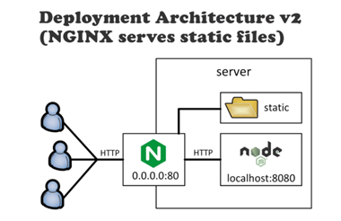

### cloud provider

this cours should include procies and ngxy and fireway and networking

there is 3 types of provider where we can host the app


for small projects use lasS, its give u full freedom to do what even u want with ur OS and install any service u want
PasS only give u only one service, like a server with nodejs, if u need something extra like redis or mongo, u have to pay for additional services that are hoiting somewhere else!
for complex big one maybe google cloud or aws, they provide auto scaling etc..

lets create a remote machine on digital ocean and connect to it using ssh (connect to the remote bash terminal)

### 2 create & acess a remote server


Here you can either choose an image that can be either a distrubutions syste, or one click app (for example an image with nodejs already installed/ just like docker images)
The best is to start with the bare disto to configure the server as we wanted

- Next add bew ssh key and post the ur own key so u can control the server from ur local device


    cat ~/.ssh/id_rsa.pub | pbcopy   <- copy ur ssh key to the buffer
    now u will be able to control ur remote service as a root with that ssh key

- Login to ur service bash
  After its created, copy the ip address of the droplet and write the command
  ssh root@ip_address

Once u have control over the bash the first thing to do is update the packgaes
apt update //ubuntu
(do we need apt-get upgrade and what is the diffrence)

Now we can install important things like git and vim etc

May install nginsx , run it and you can see the welcome page on the ip address

### 3 5 set up server

Yum -y update //use apt for ubuntu , CentOS uses yum (check lunix course for mmore details)

- CREATE NON ROOT USER

On hoisting never run any app as root

//remember now we are root

```sh
adduser anas
sudo su – anas
whoami //anas (add this to lunix course)
cd ~ //go to home
mkdir .ssh
chmod 700 .ssh //give access to the current user and not to anyone else
touch .ssh/autorized_key
chmod 600 .ssh/autorized_key
vim .ssh/autorized_key //then past my local device ssh ip there

Now instead of doing
ssh root@ip_address
We can do
ssh anas@ip_address
```

### deploy the app

lets cosider our remote server ip is 188.166.288.277 and our node js app port is 3000

- 1 Copy the local project file into a .tar.gz , make sure to ignore things like node_modules, cuz it can be installed on the server
- 2 Now send that file to the remote server using the server ip and the scp: secure copy (copies files from a device to another over the network)

```sh
scp my_app.tar.gz 188.166.288.277:~
```

for more about scr look at lunix course.

- 3 On the remote device we can extract the files into a specific folder and run npm I & npm start and we can access the app through `188.166.288.277:3000`

### manage the nide process

The problem is as long we we close the remote console the app will stop (logged out from bash server/ try it)
that is why we need a way to manage our processes, for node we use pm2

on the remote server do:

```sh
cd my_app
pm2 start --name my_app_pm2 index.js
pm2 ls

┌─────┬─────────────┬───────────┬─────────┬─────────┬──────────┬────────┬───────┬───────────┬──────────┐
│ id  │ name        │ namespace │ version │ mode    │ pid      │ status │ ↺     │ cpu       │ memory   │
├─────┼─────────────┼───────────┼─────────┼─────────┼──────────┼────────┼───────┼───────────┼──────────┤
│ 0   │ my_app      │ default   │ N/A     │ fork    │ 1234     │ online │ 0     │ 0%        │ 50.2MB   │
└─────┴─────────────┴───────────┴─────────┴─────────┴──────────┴────────┴───────┴───────────┴──────────┘
```

Now the application will be running
//if the server is shut down and restrtreetd pm2 will lose its state, and we will manually need to start it again, that’s why we can run these as root and automatically run easyio when the server is running
Pm2 startup stýstemd -u anas –hp/home/anas //add pm2 to startup system
pm2 save

(do a mode deep course on pm2)

### automated deployment

when even we change the code source, we dont wanna do the process manualy, so lets use create an `atomated script locally` and run it everything we wanna deploy a new version of the app

```bash
#!/bin/bash

tar czf my_app.tar.gz main.js package.json yarn.lock public LICENSE
scp my_app.tar.gz 188.166.288.277:~
rm my_app.tar.gz

ssh 188.166.288.277 « 'ENDSSH'
pm2 stop my_app_pm2
rm -rf my_app
mkdir my_app
tar xf my_app.tar.gz -C my_app
rm my_app.tar.gz
cd my_app
yarn install
pm2 start my_app_pm2
ENDSSH
```

Now lets give it exaction permission (+x) and run it
<<’ENDSSH’ means everything we will type later should be exucture on the remote host
now whenever our code source changed, we can just run this bash script
The app name easyio should be already in the pm2 (pm2 ls)
By default the app wont listen on port 80 or 443 so we need to set up nginx or something like that to access it through ip instead of ip:3000

### NGINX as a Reverse Proxy

As u know the app will listen on port 8000 , since we cant make node app or any other http framwork listen on port 80 or 443 because they are privileged in lunix , you can do that if you are root but it’s a bad idea to run any app as root. we need to use a webserver for that!

how to run on port 80 then ?

- run the app as root (bad idea)
- use libcap to configure permissions
- use iptables or firewall for port forwarding
- install ngnix or HAProxy and set up reverse proxy


While we are using nginx its good to make it responsible of serving static files and node focus more with the api call, because nginx is so performce at serving static files



Another this is to add https and a load balancer


why port 80 and 443
it’s the default port for http on the borswe, with that port we wont need to specify the port after the website url because it’s the default port.

### DNS

https://www.youtube.com/watch?v=d8TRPMI8lVk&list=PLQlWzK5tU-gDyxC1JTpyC2avvJlt3hrIh&index=7

When he sat dns he could still access his app through domain.com:3000, that means we can create many app on the same server that listen to different ports and have a domain name for each
But how to have a different domain for each port

- 1 First need to buy a domain name, and configure them to point on your droplet IP address,
- 2 Go to your domain name settings and point digital oceans nameservers to it , it will look something like


- 3 Now on digital ocean, go to your domains settings, enter a new domain ex anas.io, you will see a your domain settings and what ns you should link to your domain provider nameservers


- 4 Now u can assign it to a droplet

  

@ meas the domain itselt not a sub domain
It may take time to apply it, you can check by
ping anas.io

### 4 Understanding Network Interfaces----------------------------------------------------------------------

https://www.youtube.com/watch?v=PYTG7bvpvRI&list=PLQlWzK5tU-gDyxC1JTpyC2avvJlt3hrIh&index=8

skip networking for now and do other things!
