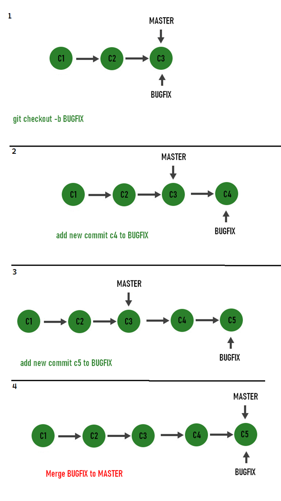

### 1. USE CASE

Git is a version control system for tracking file changes and enabling collaborative development. Git allows for saving each change in commits, which can be easily shared and used to revert to previous versions.

---

### 2. GIT SETTINGS

There are 3 levels where we can specify the settings

- system for all users of the pc
- global for all repos of the current user
- local for the current repo

These are import configuration while using git, lets apply it on a global level:

```bash
# Configure user name globally
git config --global user.name "anas oulahtak"

# Configure user email globally
git config --global user.email xx@xx.xx

# Configure default text editor globally (using Visual Studio Code)
git config --global core.editor "code --wait"

# Configure line ending conversions globally (for Windows: autocrlf = true, for Mac: autocrlf = input)
git config --global core.autocrlf true
```

To see or edit the global settings in the global .gitconfig file:
This will open the .gitconfig file in your default text editor, allowing you to view and modify the global Git settings.

```bash
git config --global --edit
```

how to execute a command for each level

```bash
sudo git config --system user.name "Your System Name"   #system level
git config --global user.name "anas oulahtak"           #global level
git config user.name "anas oulahtak"                    #local level inside the project folder
```

---

### 3. CREATING A SNAPSHOT

#### 3.1 overview

```bash
git init           # initialize empty git repo, it’s a hidden folder that store info about branceshes etc..)
git status         # Full status
git status -s      # Short status (recomanded)
git ls-file ??
```

#### 3.2 Staging files

A staging area allow us to stage files and Review the changes before making a snapshot/commit.

```bash
git add file1.js            # Stages a single file
git add file1.js file2.js   # Stages multiple files
git add \*.js               # Stages with a pattern
git add .                   # Stages the current directory and all its content
```

now see the status again using `git status` and look at the output:

- files with red color are not on the staging area yet, they got modified and they need to be staged to include them in the next commit
- files with green color are on the staging area, but if we edit `file1` and run `git status` again, the staging area will contains the old snapshot which contains an older version of file1 and that’s why we should run `git add file1` again to update the staging with the new content of file1.

```bash
git diff            # Shows unstaged changes (compare changes between the working directory and staging area)
git diff --staged   # Shows staged changes (compare changes between the staging area and repo)
git diff --cached   # Same as the above
```

#### 3.3 Committing the staged files

A commit is a record of changes, commits help us to version our applications

```bash
git commit -m “Message” # Commits with a one-line message
git commit # Opens the default editor to type a long message
```

a commit save ur changes local on a cimmit that has a id, so can always downgrand our project to it if we want

#### 3.4 Skipping the staging area

If we want to commit changes without staggig them

```bash
git commit -am “Message” # will automatically add all untracked files to the commit
```

but its suggdested to always stag the code befoe commiting, to have organized commits

#### 3.5 poshing the commits

```bash
git push # push all the commits in local repo that are not or remote repo
```

`.gitignore` is a file where we can specify file that we don’t want to be staged (commited and pushed)

#### 3.6 removing and renaming file

```bash
git rm file1.js # Removes from working directory and staging area
git rm --cached file1.js # Removes from staging area only
git mv file1.js file1.txt
```

#### 3.7 Unstaging files (undoing git add)

```bash
git restore --staged file.js # unstage the file
```

#### 3.8 Discarding local changes

```bash
git restore . # Discards all local changes (except untracked files)
git clean -fd # Removes all untracked files
```

#### 3.9 Restoring an earlier version of a file

```bash
git restore --source=HEAD~2 file.js
```

---

### 4. GIT HISTORY

History is a chain of commits, each commit has a hash_id and a message

#### 4.1 Viewing the history of commits

```bash
git log # Full history
git log --oneline # Summary
git log --reverse # Lists the commits from the oldest to the newest
```

#### 4.2 Viewing a specific commit

```bash
git show 921a2ff # Shows the given commit
git show HEAD # Shows the last commit
git show HEAD~2 # Two steps before the last commit
git show HEAD:file.js # Shows the version of file.js stored in the last commit
git log --stat # Shows the list of modified files
git log –patch # Shows the actual changes (patches)
```

#### 4.3 Filtering the history

```bash
git log -3 # Shows the last 3 entries
git log --author=“Anas”
git log --before=“2020-08-17”
git log --after=“one week ago”
git log --grep=“test” # Commits with “test” in their message
git log -S “test” # Commits with “test” in their patches
git log hash1..hash2 # Range of commits
git log file.txt # Commits that touched file.txt
```

#### 4.4 reset history to a previous commit

this commands reset the head to a given commit, let say the branch was up to date, then I committed 3 commits but did not push them.
lets say we don’t need c159 or we want to rename it.

```yaml
c159--- (head/pdf)
c158---
c157---
c156--- (origin/pdf)
```

```bash
git reset c158 # reset the head to c158
git reset HEAD~1 # does the same as above (reset to one before the head)
```

```yaml
c158--- (head/pdf)
c157---
c156--- (origin/pdf)
```

**note:** the commit will get deleted from the history but changes of `c159` won’t get lost, instead they will be staged (default behavior of reset).
to discard the changes too of that commit we can use restore after reset `git restore --staged .` or run the reset with a hard flag, `git reset --hard` and they are 3 kinds or reset flag

- `--hard` discard the changes both staged and unstaged

- `--soft` save the deleted commit changes on the staging area (default)

- `--mixed`

#### 4.4 reset History to the current head

what will happen if we just reset the the current head ?

```bash
git reset HEAD          # does nothing
git reset HEAD --hard   # unstage any staged file then discard all changes
```

so `git reset HEAD --hard` is just like doing :

```bash
git restore --staged .    # unstage all staged files
git restore .             # discard changes after usnstaging the files
```

**BTW:** `git reset HEAD` is equal to `git reset` and is equal to `git reset HEAD~`

#### 4.5 rewrite history

if we reset the local history to `c158` while `c159` was already pushed to the remote history, we will need to use `--force`/`-f` flag with `git push` because the histories are not matching, this what we call rewriting history.

**NOTE:** other developers may still relay on that commit `c159`, we need to notify them to uppdate their local history using git `git pull` otherwise they might force push their local history and it just going to be a mess.

---

### 5. BRANCHING

Branches allow us to work on a feature on another work space isolated from our main work space (master branch), then when the feature is finished we can merge it to our master branch.
**note:** our main branch does not neccessary need to be named `master`, it can be also production or development etc..

#### 5.1 Managing branches

```bash
git branch                # See the list of braches and the current bransh
git branch bugfix         # Creates a new branch called bugfix

git checkout bugfix       # Switches to the bugfix branch
git switch bugfix         # Same as the above (newest)

git checkout -b bugfix    # creates and Switches to the new bugfix branch
git switch -C bugfix      # Creates and switches

git branch -d bugfix      # Deletes the bugfix branch
git branch -D bugfix      # Forces delete
```

#### 5.2 Create a branch from a specific commit

**NOTE:** new branches by default get created based the last commit, but we can change that


#### 5.3 Comparing branches

Lists the commits in the bugfix branch not in master git diff master..bugfix # Shows the summary of changes

```bash
git log master..bugfix
```

#### 5.4 merging - Fast forward merge

on the following example, we created bug fix branch, and added two commits to it while masters is still the same (has not diverged). To merge the bugfix into master, git simply changes the pointer because we have a linear path.



#### 5.5 merging – 3 way merge

if the master branch have diverged (we have commits on the MASTER branch that are not on the BUGFIX branch), then git use the 3-way merges, its called 3-ways because it a process of creating an merge commit based on 3 commits. C3 and and the last commit of each branch


if we want fast forward merge on this case, we can rebase (page ) the BUGFIX branch to the Master branch to create a linear path

#### 5.6 Merging commands

```bash
git merge bugfix            # Merges the bugfix branch into the current branch
git merge --no-ff bugfix    # Creates a merge commit even if FF is possible
git merge --squash bugfix   # Performs a squash merge
git merge --abort           # Aborts the merge (when we git a conflict)
```

To disable fast-forward in the current repo, if we don’t want to add the flag –no-ff all time: git comfit ff no

#### 5.7 Merge conflicts

A merge conflict happens when two branches both modify the same region of a file and are subsequently merged.
or when you have a commit that its not pushed and you pop some stashes that changes same part of code as the unpushed commit

when we try to merge the feture branch to the master branch git does not know which changes it should keep, for that we have to resolve it manually

if the merge is bad and cant be solved we can run git merge - -abort to take us to the state before the merge

#### 5.8 Deleting local and remote branches

When we finish working with a branch and successfully merge it, it better to delete it both locally and remotely.

```bash
git branch -d bugfix # delete local branch
git push origin -d bugfix # delete remote brash (Git 1.7.0 or newer)
```

#### 5.9 Restore a deleted branch

If we accidently delete a branch, we can restore it if we know its last commit hash id.

#### 5.9 RESET AND REVERT, 3WAYS VS FF

```bash
git revert commit_hash #create a commit that undo stuff of another commit
```


on case of 3w merge, The created merge commit combine all the changes of the BUGFIX branch (D1 and D2) so by reverting that commit, we revert the changes of both D1 and D2
In contract if we use ff merge, we will need to revert all commit that belongs to that BUGFIX one by one


in case we don’t have c6, we can just reset the head hart to c4
(git reset -h c4 / HEAD~1)
When should no tuse reset
reset rewrite the history of comiits, therefore after reset we always need to use forc to push
If we have not shared the branch with other developers then we can use reset hard if we share it then we cant because other developer still relies on the commits that resert gonna delete so if they pushed, they need to use force too which will add the c5 again \*(because they still have it on their local repos) and things will just get into a caios. On this case revert is the best option.

#### 5.10 Viewing the merged branches

```bash
git branch --merged # Shows the merged branches to the current brunch
git branch --no-merged # Shows the unmerged branches
```

### 6. Rebasing

usecase
as I mentioned on page , if we want fast-forward when master have diverge, will rebase fix the problem When we merge?

```bash
git checkout BUGFIX
git rebase master # Changes the base of the current branch to the latest commit of master
```


now to merge BUGFIX to MASTER, git will perform a ff merge
**NOTE:** Rebasing rewrites history


Actually git wont change the base of BUGFIX because commits in git are immutable, so git will create a commit c5\* that looks exactly like C5 and base it on the latest commit in master. And since C5 won’t have any pointer, it will get automatically deleted

Rebasing rewrite history, and therefore we need to use push force
Its fine to rebase while working on a local feature, but if another developer are depending on tha same brash, rebasing may cause issues

note What if we rebase and push without force

use git pull because my local bransh history does not match the remote branch, I used it , the branch got merged which caused an extra commit. \*(3way diagram

When I pushed again, I could see a lot of chris old commits behind mines because of the merge, the branch history got dirty

to solve this:

- git reset HEAD~1 --hard , we need only one because the merge commit was the last one, so we went back one step on the history.
- git push -f (problem solved) push again with foece

Rebase moves all the feature commit on top of it to look start working on the feature with the code from lastest commit of the master branch (updated)

rebase also has a feture called squash
sometimes u make a lot of commits while working on a feture that are not really nessasary when the feture finally get merged the master bransh

squash = conbine multiple commits few or one

On feture branch run:
git rebase master –interactive
• this will oull up a document on the editor

This usually last thing to do before submitting a pull request or merge the feture back on the master branch

rebase use cases

stackoverflow 545
we can also use rebase to update a branch to its main parent branch

### 7. cherry-pick (and checkout from a specific commit)


git cherry-pick dad47ed # Applies the given commit on the current branch
we can use chery pick to select only specific commits from a branch
another useful case is to delete a commits from the middle of the history:


git checkout A
git checkout C1
git checkout -b B

git cherry-pick C3
git cherry-pick C4

git checkout A
git reset --hard C1
git merge B

git branch -D B

git push -- force

--force -f
--hard -h

### 8. STACHING

When we switch branches get reeeset our working dir to snapshot stroed in the last commit of the target branch, if we have some changed that are noit commited yet , they can get lost, and therefore git does not allow us to change branches, that why we should stach these changes \*(storing the changes without comiting it ) then we can switch to the next branch

git stash push -m “New tax rules” # Creates a new stash
git stash list # Lists all the stashes
git stash show stash@{1} # Shows the given stash
git stash show 1 # shortcut for stash@{1}

in case we finished working the that bransh and now we come back the the main bransh,

git stash apply 1 # Applies the given stash to the working dir
git stash drop 1 # Deletes the given stash
git stash clear # Deletes all the stashes important to clean up things

git stash save ->stores all the modified tracked files.
git stash pop ->restores the most recently stashed files.
git stash list ->lists all stashed changesets.
git stash drop ->discards the most recently stashed changeset.

exercce, rabse push and merge locally or pull again
pull changes fom remote to master and rebase bugfix

Rebase a branch, ex> keep pdf feauture up-to-date with the master branch
git stash
git checkout dev (main branch that other feture created from it)
git pull (update the branch)
git checkout pdf
git rebase dev (rebase pdf to dev)
git stash pop (put our changes back)

### 9. Collaboration using Git & GitHub (PR)

Create new breach
switch to it
stage files and comit changes to the local repo
git push to push our commits to the remote repo
Now go to github, click the green button, request the senuior, click greenb btn again

Sp I have just moved all our repositories to a new organization so you need to change your git remote from git@github.com:swacedigital/_ to git@github.com:BudID-Technologies/_

git remote
git remote show origin / git remote -v

git remote set-url origin git@github.com:BudID-Technologies/\*

### 10. Cloning and updating

• git clone -> bring a repo down from the internet (remote repository like Github) to your local machine
• git clone custum_folder_name
• git pull -> fetches and merges changes on the remote server to your working directory. (it’s a combo or git fetch + git merge)
Git fetch -> check if there is any updates (new commit) on the remote repo
• Git merge -> merge new commits from the remote repo to the local one

just git pull under the hood runs Git pull orgin master

Remember that this wont work if we have local changes that are not commited! There for we need to commit the changes or stash them
• init -> use this command inside of your project to turn it into a Git repository and start using Git with that codebase

### extra

SSH
PR
If we cloned a projects we can push directly with no problem
but if we don’t (maybe just downloaded the files) we need to get a git remote add origin repo-ssh-url

Every time we want to push , we have to use git push origin master (or any branch name)
set upstram -> git push -u origin master (next time we can just use git push)

Git origin is a pointer , its tge url of the repo

Git push origin vs git push

Git push origin vs git push

git migration:
https://www.youtube.com/watch?v=4OkgopNIMM4
