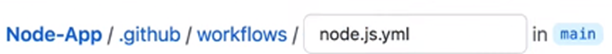
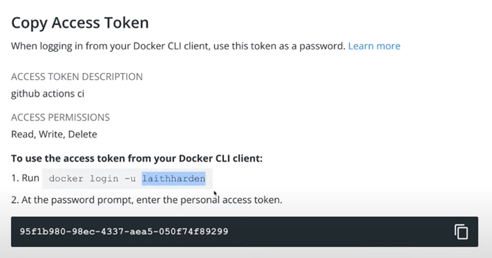
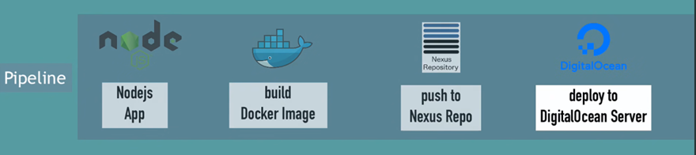
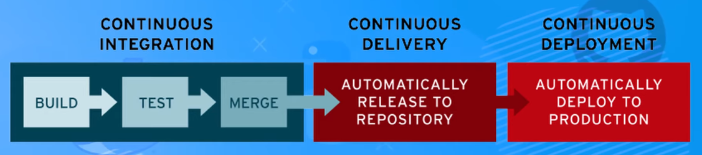

### 1 CI CD

Git and continuous delivery
Using continuous delivery for deploying our applications requires some care when handling Git branches.
• The master branch is the production branch, while the develop branch is the staging branch.
• Changes should never be committed or pushed to the master branch directly—they should always be merged into master from the develop branch instead.
• All changes should be made in a separate branch, created from the develop branch.
• When changes are completed and reviewed, they should be merged into the develop branch and deployed to the staging server.
• Once the changes have passed any additional checks on the staging server, the develop branch can be merged into the master branch and deployed to production.
git commit --no-verify
https://www.digitalocean.com/community/tutorials/js-js-singletons

--husky with bash file works only on version 4
npm install -D husky@4

See how did it set up git with husky and perttier and eslint on my repo

workflow skills / git / github / actions / docker / husky / puputeer / jest

CI CD pipline WORK FLOW
ggithub action are like Jenkins

GITHUB ACION IS a platform to automate developer workflow

after each pr I WANT MAKE SURE THAT

- the build is successful
- all tests are passed
  MAYBE ALSO build a docker image and push it to docker hub

How to set up a workflow:
github repo > new work flow > then select any template

what it gona do it create a configuration file inside our project that we can also create manually

And this is how a configuration looks like

Lets have to workflows
integration.yml

name: Integration

on:
push:
branches: [main]
pull_request:
branches: [main] #any pr that compares with main bracch

jobs:
build:
runs-on: ubuntu-latest

    strategy:
      matrix:
        node-version: [12.x, 14.x, 16.x]
        # See supported Node.js release schedule at https://nodejs.org/en/about/releases/

    steps:
      - uses: actions/checkout@v2
      - name: Use Node.js ${{ matrix.node-version }}
        uses: actions/setup-node@v2
        with:
          node-version: ${{ matrix.node-version }}
          cache: 'npm'
      - run: npm i
      - run: npm run build

unit-tests:
runs-on: ubuntu-latest

    strategy:
      matrix:
        node-version: [12.x, 14.x, 16.x]
        # See supported Node.js release schedule at https://nodejs.org/en/about/releases/

    steps:
      - uses: actions/checkout@v2
      - name: Use Node.js ${{ matrix.node-version }}
        uses: actions/setup-node@v2
        with:
          node-version: ${{ matrix.node-version }}
          cache: 'npm'
      - run: npm i
      - run: npm run test

release.yml
1 first make sure to create a dockerhub repo with a specific name
2 go to github/settings/secrets/action and add two secrets
DOCKERHUB_USERNAME and DOCKER_PASSWORD
DOCKER_PASSWORD should be the dockerhub accesstoken

this photo shows username and password as a token

now lets create a rease job when even something is merged(pushed) on the main branch
name: Release

    on:
      push:
        branches: [main]

    jobs:
      deploy:
        runs-on: ubuntu-latest

        steps:
          - uses: actions/checkout@v2
          - run: docker build . -t laithharden/nest-app
          - run: echo "${{secrets.DOCKER_PASSWORD}}" | docker login -u ${{secrets.DOCKERHUB_USERNAME}} --password-stdin
          - run: docker push laithharden/nest-app

